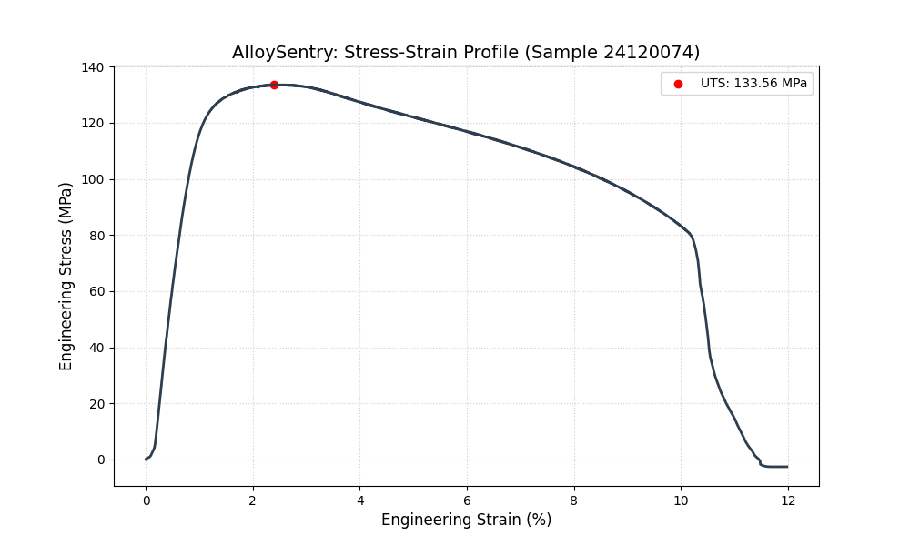
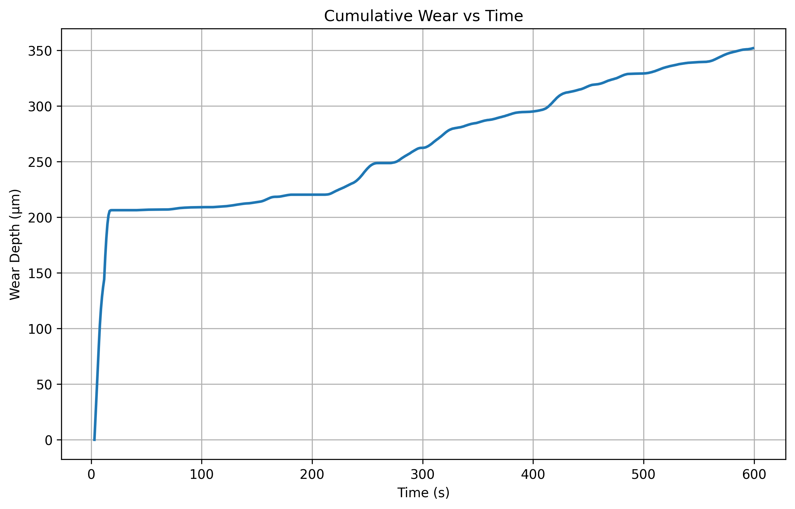

# 🔬 AlloySentry
**Automated Metallurgical Analysis Pipeline using Gemma 4**

AlloySentry is a "Software-Defined Metallurgy" project that automates the transition from raw laboratory hardware data to professional engineering reports. It processes tensile and wear test data and uses a local Large Language Model (Gemma 4 e4b) to interpret material behavior.

## 🚀 Features
* **Automated Data Parsing:** Extracts UTS and ductility from CSVs and friction coefficients from DWF files.
* **AI-Driven Reasoning:** Integrates **Gemma 4** to determine processing routes (Cast vs. Wrought) and evaluate hardness-toughness trade-offs.
* **Visualization:** Generates high-quality stress-strain and wear depth profiles.

## 📊 Sample Analysis Results
Based on a recent test run of an Al-Si specimen:
* **Tensile Strength (UTS):** $133.56 \text{ MPa}$
* **Ductility (Elongation):** $11.98\%$
* **Max Wear Depth:** $296.56 \mu\text{m}$
### Visualizations

### AI-Generated Insight
> "The balance between the measured strength and the substantial elongation strongly suggests that the material has not been extensively cold-worked or rolled, pointing toward a casting or simple ingot processing route." 

## 🛠️ Tech Stack
* **Language:** Python (Pandas, Matplotlib)
* **AI Model:** Gemma 4 (e4b) via Ollama
* **Domain:** Physical Metallurgy / Materials Testing
